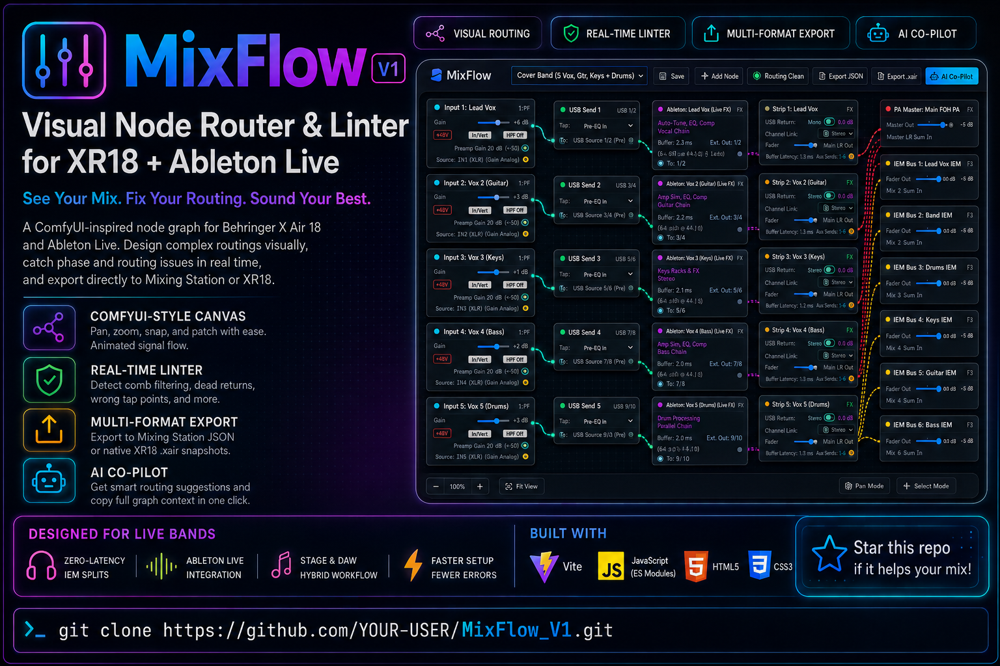

# 🎛️ MixFlow: Visual Node Router & Linter for Mixing Station (XR18)



**MixFlow** is a modular, ComfyUI-inspired node-graph web application designed for live bands using the **Behringer X Air 18 (XR18 / X18 / MR18)** and **Ableton Live (Mac Mini)**. 

It provides an interactive, dark-themed hardware canvas to visually route stage preamps, USB 18x18 DAW processing, stereo effects returns, Aux 1–6 in-ear monitor buses, and FOH PA outputs — with real-time phase/routing error detection, multi-format configuration export, an integrated Web Audio test tone generator, and an AI routing co-pilot.

---

## ✨ Features

- **ComfyUI-Style Visual Canvas**:
  - Interactive Bezier curve patch cables with animated signal flow pulses.
  - Color-coded audio signal paths (Vocals, Guitars, Keys, Playback/Click, IEMs, Main PA).
  - Smooth pan/zoom, magnetic socket snapping, and drag-and-drop patching.
  - In-place double-click node renaming.
- **Full Hardware & DAW Node Ecosystem**:
  - **Stage Input Preamps** (XLR 1–16 + Aux 17/18 with Gain `-12..+60dB`, `+48V` Phantom, HPF, Invert, and Direct 0ms Analog IEM Split).
  - **XR18 USB Send Matrix** (18-channel tap points: `Analog In`, `Pre-EQ`, `Post-EQ`, `Pre-Fader`, `Post-Fader`).
  - **Ableton Live Racks** (DAW tracks with live plugins, autotune, amp modelers, buffer latency meter, and Mono / `Ext. Out 1/2` Stereo outputs).
  - **XR18 Channel Strips** (`rtnsw` Analog vs. USB Return switch, Mono / Stereo Link toggle, faders, mutes, Aux 1–6 sends).
  - **Output Destinations** (Main FOH PA Stereo L/R, Aux 1–6 In-Ear Monitors with performer labels).
- **Web Audio API Test Tone & Pink Noise Generator**:
  - Pure 1kHz calibration Sine wave (sweepable 40Hz–12kHz).
  - Full-spectrum Pink Noise & White Noise.
  - Calibrated output level control (`-40 dBFS` to `0 dBFS`).
  - In-Inspector audio injection for gain staging and IEM testing.
- **Channel & Node Inspector Drawer**:
  - Focus view on any channel or hardware rack.
  - Real-time parameter adjustment (Gain, Fader, `+48V`, `rtnsw`, Tap Points).
  - **1-Click Auto-Fix Actions** on all linter diagnostic alerts.
- **Real-Time Routing Linter & Error Detection**:
  - 🚨 `ERR_COMB_FILTER`: Detects double-monitoring comb filtering / phase cancellation.
  - 🚨 `ERR_DEAD_RETURN`: Detects silent channel strips with USB Return enabled without DAW feeds.
  - ⚠️ `WARN_TAP_POST_FADER`: Warns against post-fader taps for live autotune/plugins.
  - ⚠️ `WARN_PHANTOM_LINE`: Warns against +48V phantom power on line-level stereo instruments.
- **Multi-Format Export & Import**:
  - 💾 **Mixing Station JSON Scene/Preset**: Direct import into the Mixing Station app.
  - 📄 **Native XR18 OSC Snapshot (`.xair` / `.scn`)**: Line-by-line OSC snapshot file for X-Air Edit.
- **Editable & Custom Templates System**:
  - Save custom rigs with 1 click directly to browser storage.
  - Overwrite, clone, rename, delete, backup, and restore template libraries.
  - Pre-loaded with:
    - `⚡ Zero-Latency Direct IEM + Ableton FOH Hybrid`
    - `Cover Band (5 Vox, Gtr, Keys 1:1 DAW Return)`
    - `Cover Band (Stem Subgroups)`
- **AI Routing Co-Pilot Sidebar**:
  - Slide-out assistant wired for **Antigravity (AGY)**, **OpenAI Codex / GPT-4o**, and local LLM endpoints.
  - 📋 1-Click **"Copy Prompt"** button that exports the full live JSON graph topology for pasting into Codex CLI or AGY terminal.

---

## 🚀 Quick Start

### 1. Install Dependencies
```bash
npm install
```

### 2. Run Local Dev Server
```bash
npm run dev
```
Open `http://localhost:3000` in your browser.

### 3. Run Tests
```bash
npm test
```

### 4. Build for Production
```bash
npm run build
```

---

## 📁 Project Structure

```
mixflow-ui/
├── mixflow_graphic1.png        # App infographic & diagram
├── index.html                  # Main application HTML shell
├── package.json                # Project scripts & dependencies (Vite, Vitest)
├── vite.config.js              # Vite configuration
├── src/
│   ├── main.js                 # Application entrypoint & toolbar controller
│   ├── graph/                  # Core DAG model (Graph, Node, Port, Connection)
│   ├── canvas/                 # CanvasRenderer, InteractionHandler, Bezier curves
│   ├── audio/                  # ToneGenerator Web Audio API engine
│   ├── components/             # Inspector drawer & TemplateEditorModal
│   ├── nodes/                  # StageInputNode, USBSendMatrixNode, AbletonLiveNode, ChannelStripNode, OutputBusNode
│   ├── linter/                 # Real-time audio routing validation rules engine
│   ├── exporter/               # Mixing Station JSON & XR18 OSC snapshot exporters/importers
│   ├── templates/              # Built-in band rigs & TemplateManager
│   ├── copilot/                # AI Co-pilot assistant sidebar & context serializer
│   └── styles/                 # Dark theme tokens, canvas, main layout, copilot drawer
├── tests/                      # Automated unit tests (Vitest)
└── docs/                       # Design specifications & implementation plans
```

---

## 📄 License
MIT
